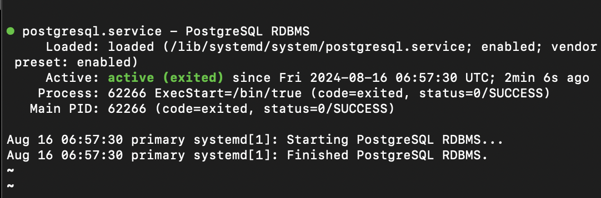

# Set up PostgreSQL High Availability with Pgpool Tutorial

## 1. Set up master-slave

### Step 0: Set up proxy for virtual machine
- Set up apt:
 ```shell
    sudo nano /etc/apt/apt.conf
    Acquire::http::Proxy "http://10.61.11.42:3128";
    Acquire::https::Proxy "https://10.61.11.42:3128";
    
```
- Set up openssh
 ```shell
    /* install openssh */
    sudo apt install openssh-server  

    /* ssh from local terminal */
    ssh username@ip
```

- Set up docker:

 ```shell
sudo mkdir /etc/systemd/system/docker.service.d/

sudo nano /etc/systemd/system/docker.service.d/http-proxy.conf
[Service]
Environment="HTTP_PROXY=10.61.11.42:3128/" "HTTPS_PROXY=10.61.11.42:3128/" "NO_PROXY=localhost,127.0.0.0/8"

sudo systemctl daemon-reload
sudo systemctl show docker --property Environment
sudo systemctl restart docker

```

- Set up git: 
 ```shell
git config --global http.proxy http://10.61.11.42:3128
git config --global https.proxy http://10.61.11.42:3128
OR
git config --system http.proxy http://10.61.11.42:3128
git config --system http.proxy http://10.61.11.42:3128

git config --global --get http.proxy
git config --global --unset http.proxy

```
- Set up wget:

 ```shell
sudo nano /etc/wgetrc

# file config
use_proxy=yes
http_proxy=10.61.11.42:3128
https_proxy=10.61.11.42:3128
```

### Step 1: Set up PostgreSQL database bằng bash script
<!-- - [Set up PostgreSQL server](https://dev.to/vishalpaalakurthi/how-to-set-up-a-postgresql-server-on-a-virtual-machine-473f)
- [Enable PostgreSQL replicas](https://www.heatware.net/postgresql/setup-data-replication-postgresql-ubuntu/)
- Tạo replicas thì replicas có feature chấp nhận read-only connections còn primary có thể chấp nhận cả read-write connection -->

- Trước đó cần cài đặt proxy cho apt và wget

- Tạo file bash script và copy nội dung dưới đây vào file:

```shell
    $ sudo vi install_postgresql.sh

    # file config
    #!/bin/bash

    # Update the package list and upgrade installed packages
    sudo apt update
    sudo apt upgrade -y

    # Install PostgreSQL repository key
    wget --quiet -O - https://www.postgresql.org/media/keys/ACCC4CF8.asc | sudo apt-key add -

    # Add PostgreSQL repository
    RELEASE=$(lsb_release -cs)
    echo "deb http://apt.postgresql.org/pub/repos/apt/ $RELEASE-pgdg main" | sudo tee /etc/apt/sources.list.d/pgdg.list

    # Update the package list again
    sudo apt update

    # Install PostgreSQL 14
    sudo apt install -y postgresql-14

    # Optional: Install additional PostgreSQL contrib packages
    sudo apt install -y postgresql-contrib-14

    # Start and enable PostgreSQL service
    sudo systemctl start postgresql
    sudo systemctl enable postgresql

    echo "PostgreSQL 14 has been installed successfully."
 ```

- Cấp quyền thực thi và chạy file bash script để cài đặt postgreSQL:
```shell
     $ sudo chmod +x install_postgresql.sh && ./install_postgresql.sh
```

- Truy cập file cấu hình PostgreSQL và sửa để có thể nhận kết nối từ các server khác
     ```shell
     $ sudo vi /etc/postgresql/14/main/postgresql.conf

     # sửa file config
     listen_addresses = '*'
     ```

- Khởi động lại PostgreSQL và chỉnh sửa file chứa các quy tắc xác thực phân quyền thành như sau:

```shell
     $ systemctl restart postgresql 
     $ sudo vi /etc/postgresql/14/main/pg_hba.conf 

     #Sửa địa chỉ kết nối
    # TYPE  DATABASE        USER            ADDRESS                 METHOD
    local   all             all                                     peer
    # IPv4 local connections:
    host    all             all             0.0.0.0/0               scram-sha-256
    # IPv6 local connections:
    host    all             all             ::1/128                 scram-sha-256
    # Allow replication connections from localhost, by a user with the
    # replication privilege.
    local   replication     all                                     peer
    host    replication     all             127.0.0.1/32            scram-sha-256
    host    replication     all             ::1/128                 scram-sha-256
```

- Mở firewall và port 5432 để có thể truy nhập từ bên ngoài

    ```shell
    $ sudo ufw enable 
    $ sudo ufw allow 5432/tcp
     ```

- Ngoài ra sau khi mở firewall để ssh được từ máy local cũng cần cho phép truy nhập từ bên ngoài từ cổng 22

```shell
    # kiểm tra xem đã cho phép kết nối qua port 22
    $ sudo ufw status
    # Nếu không
    $ sudo ufw allow 22/tcp
 ```
- Kiểm tra trạng thái của các server bằng câu lệnh

```shell
    $ systemctl status postgresql
```



### Step 2: Set up Master
- Cấu hình node master:
```shell
    # Chuyển qua user postgres
    $ sudo su - postgres

    # Tạo user replicator trong cơ sở dữ liệu PostgreSQL
    $ createuser --replication -P -e replicator

    # Thoát khỏi user postgres
    $ exit
 ```

- Thêm các node slave:
```shell
    # Chuyển qua user postgres
    $ sudo vi /etc/postgresql/14/main/pg_hba.conf

    # Thêm các địa chỉ IP của các node slave vào cuối file
    host    replication     replicator      172.16.149.137/24       md5
    host    replication     replicator      172.16.149.137/24       md5

    # Khởi động lại PostgreSQL
    $ systemctl restart postgresql

```

### Step 3: Set up Slave
- Thực hiện cấu hình slave theo các bước sau:

 ```shell
    # Chuyển qua user postgres
    $ sudo vi /etc/postgresql/14/main/pg_hba.conf

    # Thêm các địa chỉ IP của các node slave vào cuối file
    host    replication     replicator      172.16.149.136/24       md5
    host    replication     replicator      172.16.149.137/24       md5

    # Khởi động lại PostgreSQL
    $ systemctl restart postgresql

```
    


sudo pg_basebackup -h 172.16.149.134 -D /var/lib/postgresql/14/main -U replicator -P -v -R -X stream -C -S slave_1

sudo -i -u postgres psql -c "ALTER USER postgres PASSWORD '123456';"
