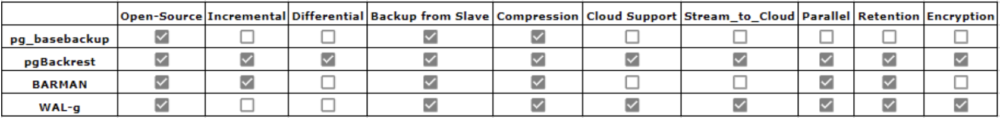
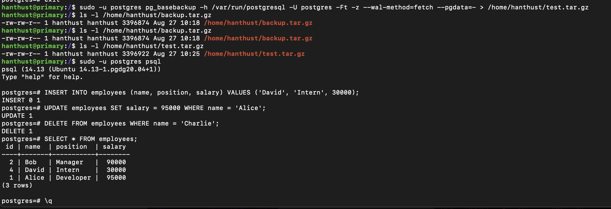

# Viettel Digital Talent 2024 - PHASE 2 - Project
Author: **Nguyen Thu Ha**

## Table of Contents 
- [0. Project Description](#0-project-description)
- [1. PgBouncer](#1-pgbouncer)
- [2. Pgpool-II](#2-pgpool-ii)
- [3. HAproxy](#3-haproxy)
- [4. Xây dựng mô hình](#4-xây-dựng-mô-hình)
- [5. Set up PostgreSQL HA](#5-set-up-postgresql-ha)

## 0. Project description

### Đề bài
- Xây dựng tính năng read/write splitting cho dịch vụ Database as a service
    - Cho phép ứng dụng điều hướng các write traffic (insert, update, delete queries) đến read-write instances (thường là primary node)
    - Cho phép ứng dụng điều hướng các read traffic (select queries) đến read-only instances. 
- Requirements: 
    - Xây dựng các read-only nodes chỉ làm nhiệm vụ xử lý các select queries và replicate data từ primary node (không làm nhiệm vụ thay thế khi primary node bị sập => đã có 1 standby làm nhiệm vụ này)
    - Tự động điều chỉnh số lượng read-only nodes theo yêu cầu của người dùng
    - 
- anc

## 1. PgBouncer

### Tổng quan
- PgBouncer:
    - connection pooling in PostgreSQL
    - Không hỗ trợ load balancing (LB) và high-availability => Dùng HAProxy hoặc Pgbool II

- Khi nhận được 1 yêu cầu kết nối từ người dùng, PgBouncer làm nhiệm vụ xác thực người dùng thay cho PostgreSQL server. PgBouncer hỗ trợ mọi cơ chế xác thực của PostgreSQL. Có 2 phương thức xác thực:
    - PgBouncer check userlist.txt file lưu dưới dạng các set tuples (username, md5 encrypted, passwords) => nếu có username trong file => check password => nếu password trùng thì không tạo kết nối mới tới SQL server
    - Xác lập passthrough authentication & không tìm thấy user trong userlist.txt => PgBouncer tìm kiếm auth_query => Kết nối đến PostgreSQL dưới dạng predefined user (người dùng đã được xác định trước với password đã có trong file userlist.txt) => Thực hiện truy vấn xác thực để tìm mật khẩu và khớp với giá trị đã được cấp
    => 1 trong những ưu điểm của PgBouncer so với Pgpool-II vì thực hiện chuyển tiếp yêu cầu xác thực qua PostgreSQL server, không cần config lại PgBouncer khi có sự điều chỉnh (vd:password) ở PostgreSQL server

- Sau khi xác thực client, PgBouncer thực hiện thiết lập kết nối.

- Sau khi đã kết nối, PgBouncer dựa vào pooling mode để trả lại connecttion cho database. Trước khi trả lại kết nối, PgBouncer chạy reset query thực hiện xoá các thông tin phiên (đảm bảo an toàn khi chia sẻ connections giữa các clients khác nhau) 

### Setup PgBouncer 
- Tutorial: [Document](https://www.linkedin.com/pulse/efficient-postgresql-management-complete-guide-installing-configuring-rxkzc/)
- Tutorial youtube: [Youtube](https://www.youtube.com/watch?v=ddKm7a7xOpk&t=196s&pp=ygUoc2V0IHVwIGFuZCBjb25maWd1cmUgcGdib3VuY2VyIG9uIHVidW50dQ%3D%3D)
- https://severalnines.com/blog/guide-using-pgbouncer/

## 2. Pgpool-II

### Tổng quan
- Pgpool-II hỗ trợ 
    - Automated load balancing => cân bằng tải giữa masters và slaves => write loads được đưa đến master + read loads được đưa đến slaves
    - High-availability => Tạo logical replication (option cho phiên bản cũ của PosrgreSQL còn với phiên bản mới của PostgreSQL đã có inbuilt replication)
    - Connection pooling


### Cách thức hoạt động của Connection pooling

 
- Tiến chính cha của Pgpool-II forks 32 tiến trình con (dùng cho việc kết nối với database) => tương tự với kiến trúc của PostgreSQL: 1 process = 1 connection
- Kernel điều hướng các kết nối mới tới 1 trong các tiến trình con (cả Pgpool-II và end users đều không thể quyết định tiến trình con nào sẽ nhận kết nối). Nếu không có tiến trình con nào nhận yêu cầu kết nối thì yêu cầu kết nối sẽ được đẩy vào hàng đợi
- Nhận xét:
    - Pgpool không thực sự tốt trong connnection pooling đặc biệt với số lượng client nhỏ. Do mỗi tiến trình con có 1 pool riêng và không có cách kiểm soát yêu cầu kết nối nào sẽ đến tiến trình con nào.
    - Pgpool làm rất tốt việc load balancing và là tool xây dựng cho postgreSQL

### Load balancing in PgPool-II
- Hiện tại Pgpool-II đã có version 4.5.3

### Config Pgpool-II
- [Tutorial](https://elroydevops.tech/postgresql-high-availability-master-slave/)

## 3. HAproxy

### Tổng quan

### Setup and config HAproxy cho load balancing

## 4. Xây dựng mô hình
- Connection pooling: pgBouncer

- Load balancing
    - Pgpool-II:
        - Đảm nhận Automatic failover cho cluster=> viết script để khi primary node gặp lỗi sẽ chuyển sang standby 
        - High availability => PgBouncer có các watchdog (giống các replica) để thay thế khi gặp failover
        - Load balancing: sau khi xem xét 4 lựa chọn cho PostgreSQL database ở [link](https://www.heatware.net/postgresql/postgresql-load-balancing-options-ha/) thì Pgpool-II là tối ưu nhất => Có thể config Pgpool-II để gửi write requests đến primary node và read requests đến replicas.
Hoặc
    - HAproxy

- Automatic failover and backup: repmgr

- PostgreSQL built-in streaming replication: sync data giữa primary và replicas


- Mô hình đơn giản như sau:

    - Sử dụng HAproxy cho load balancing:
    

    - Sử dụng pgpool-II cho load balancing:

## 5. Set up postgreSQL HA

### Tổng quan
- Triển khai database trên 3 server khác nhau trong đó có 1 node là master 2 node còn lại là slave. 
    - Server 1: 172.16.149.134 - Server master
    - Server 2: 172.16.149.136 - Server slave 1
    - Server 3: 172.16.149.137 - Server slave 2 (standby replica)
    - Server 4: 172.16.149.139 - HAproxy 
- Các bước cấu hình
    - Thiết lập master-slave
    - Thiết lập PostgreSQL HA
    - Thiết lập automatic failover và backup
- [Chi tiết các bước cấu hình](https://github.com/nguyenha-meiii/vdt2024_phase2/tree/main/PostgresSQL%20HA)

### Mục tiêu
- Xây dựng hệ thống master - slave với node slave chỉ phục vụ read queries còn master node phục vụ cả read-write queries và nếu master node bị hỏng 1 node slave lên thay thế làm node master
- Thiết lập high availability (HA) cho PostgreSQL với HAproxy
    - Kết nối 3 servers PostgreSQL thành 1 connection duy nhất
    - Thực hiện load balancing giữa các servers (mục tiêu của mình là đẩy hết các read queries qua slave và để master chỉ nhận các write queries nhưng hiện tại em chưa tìm ra được tutorial nào, kết quả đầu ra hiện tại sẽ là chia tải về 3 servers)


## 6. Backup and failover

### Split brain
- Trong một hệ thống HA (VD): PostgreSQL cluster), bị phân mảnh do network patrition => Có nhiều hơn 1 master trong cluster => Dẫn đến mất mát và không đồng nhất dữ liệu
- Nguyên nhân dẫn đến split-brain:
    - Các vấn đề về mạng: network congestion, firewall misconfigurations, routing errors
    - Lỗi hardware/software: disk/memory failure, OS crash,...
    - Lỗi config: Incorrect configuration => data inconsistencies

### Overview
- Backup - Backup Database Cloud Service (DBaaS) instances: bảo vệ instances software, configuration và database nếu failover xảy ra
- Restore - Restore an instance from a backup: restore instances software, configuration và database với trạng thái ở thời điểm được backup

### Backup
- 3 approaches to back up postgreSQL
    - Logical backup/ SQL dump: 
        - pgdump/ pgdumpall
    - Physical backup/ File system level backup: pg_basebackup
        - Physical backup of the data directory
        - Block level backup of the volume on which data directory resides
        => Challenge with the above options: database needs to be offline or put into snapshot mode (using pg_start_backup() function )
        - Barman and pgBackrest
    - Continuous archiving and point-in-time recovery (PITR): combine a file system level backup and WAL files

- Comparison of backup tools:


- Comparison:
    - PgBarman/ Barman
        - supports basse backup via 2 methods: pg_basebackup (backup_method = postgres) && rsync (backup_method=rsync)
        - support WAL (write ahead logs) transfer via WAL archiving && WAL via streaming replication with replication slot
    - pgbackrest
        - Pgbackrest relies on WAL archiving using its own archive_command and its own file transfer mechanism (better and safer than rsync)
        - Can backup in 3 ways:
            - Full backup: every file under the database directory, the only backup pgBackRest can load by itsself
            - Differential backup: only retrieves files that have changed since the last full backup => both full and differantial backup must be intact
            - Incremental backup: retrieves files that have changed since the last backup (Full/Differential backup)
    - pg_basebackup:
        - For consistent data = corrupted base backup + WAL (since we are copying data while it is modified and this will return broken, incomplete and wrong data files so we need to repair inconsistencies using PostgreSQL transaction log)
        - A basebackup does not contain WAL so we need to add --wal-method=stream when calling pg_basebackup. It will open a second stream which fetches the WAL created during the backup. 

        ```shell
        pg_basebackup -D /target_dir 
        -h master.example.com --checkpoint=fast 
        --wal-method=stream -R
        ```
        (-R will automatically set the necessary parameters to run streaming replication. For Point-In-Time-Recovery, -R is not necessary nor useful)

        - Throtting backups to have some spare capacity for network connections (of course it will increase backup times):
        ```shell
        -r, --max-rate=RATE    maximum transfer rate to transfer data directory
                                (in kB/s, or use suffix 'k' or 'M')
        ```


### Set up backup and restore wwith pg_basebackup

- Create backup file

 ```shell
    #Tạo file backup
    sudo -u postgres pg_basebackup -h /var/run/postgresql -U postgres -Ft -z --wal-method=fetch --pgdata=- >  /home/hanthust/backup.tar.gz

    #Kiểm tra file backup đã được tạo chưa
    $ ls -l /home/hanthust/backup.tar.gz
    -rw-rw-r-- 1 hanthust hanthust 3394712 Aug 27 06:57 /home/hanthust/backup.tar.gz

```

- Extract & Check backup file
    - Set up a new table
     ```shell
        sudo -u postgres psql

        #Create a table and insert initial data
        CREATE TABLE employees (
            id SERIAL PRIMARY KEY,
            name VARCHAR(100),
            position VARCHAR(100),
            salary INTEGER
        );

        INSERT INTO employees (name, position, salary) VALUES
        ('Alice', 'Developer', 80000),
        ('Bob', 'Manager', 90000),
        ('Charlie', 'Analyst', 70000);

         # Exit psql
        \q
    ```
    

    - Create backup

    ```shell
        # create a backup
        $ sudo -u postgres pg_basebackup -h /var/run/postgresql -U postgres -Ft -z --wal-method=fetch --pgdata=- > /home/hanthust/test.tar.gz

        # Verify if backup file is created
         $ ls -l /home/hanthust/test.tar.gz
    ```

    - Make changes to the database

    ```shell
        sudo -u postgres psql

        # Make some changes
        INSERT INTO employees (name, position, salary) VALUES ('David', 'Intern', 30000);
        UPDATE employees SET salary = 95000 WHERE name = 'Alice';
        DELETE FROM employees WHERE name = 'Charlie';

        # Verify changes
        SELECT * FROM employees;

        # Exit psql
        \q
    ```
    

    - Restore the backup

    ```shell
        # Stop postgreSQL
        $ sudo systemctl stop postgresql

        # Clear the dât directory
        $ sudo -i
        $ rm -rf /var/lib/postgresql/14/main/*

        # Restore the backup
        $ sudo -u postgres tar -xzf /home/hanthust/test.tar.gz -C /var/lib/postgresql/14/main

        # Set permission
        $ sudo chown -R postgres:postgres /var/lib/postgresql/14/main
        $ sudo chmod 700 /var/lib/postgresql/14/main

        # Start postgreSQL
        $ sudo systemctl start postgresql
    ```

    - Verify restoration

    ```shell
       # Connect to PostgreSQL
        sudo -u postgres psql

        # Connect to the testdb
        \c testdb

        " Check the data
        SELECT * FROM employees;

        # Exit psql
        \q
    ```
    