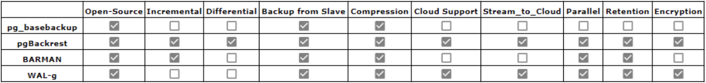
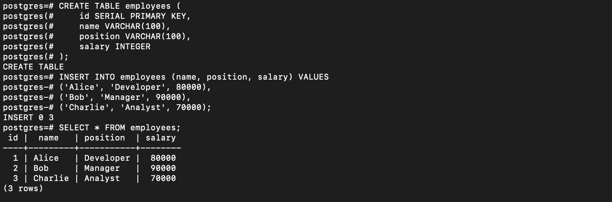
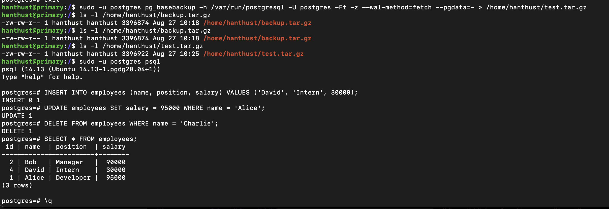
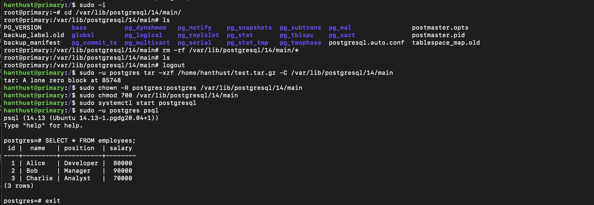
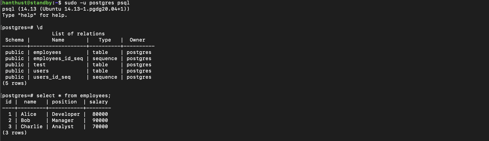
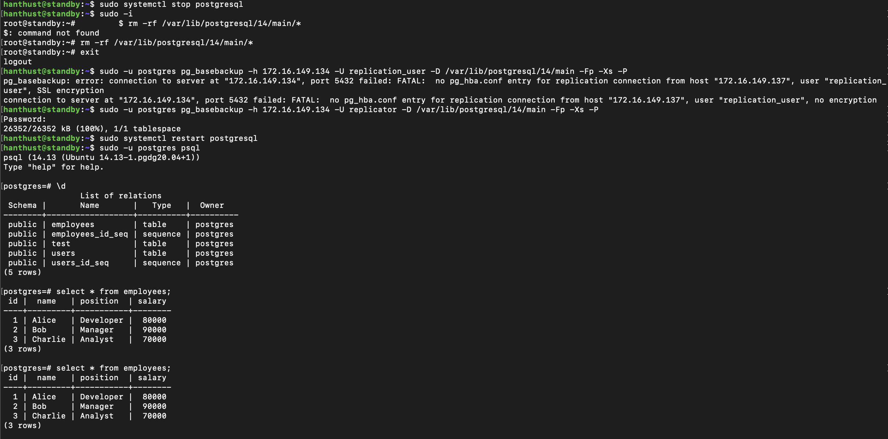

# BÁO CÁO TUẦN 4

## MỤC TIÊU
- Triển khai backup và restore cho node primary
    - Sử dụng pg_basebackup
    - Tìm hiểu thêm về pg Backrest, Barman
- Config manual failover
    - Khi node primary down, sẽ đẩy 1 node replica có data sát nhất với primary lên thay thế
    - Cần cơ chế xác nhận dữ liệu của replica gần nhất với primary
    - Tìm hiểu cơ chế phục hồi node từ backup


## NGHIÊN CỨU

### Split brain
- Trong một hệ thống HA (VD): PostgreSQL cluster), bị phân mảnh do network patrition => Có nhiều hơn 1 master trong cluster => Dẫn đến mất mát và không đồng nhất dữ liệu
- Nguyên nhân dẫn đến split-brain:
    - Các vấn đề về mạng: network congestion, firewall misconfigurations, routing errors
    - Lỗi hardware/software: disk/memory failure, OS crash,...
    - Lỗi config: Incorrect configuration => data inconsistencies

### Overview
- Backup - Backup Database Cloud Service (DBaaS) instances: bảo vệ instances software, configuration và database nếu failover xảy ra
- Restore - Restore an instance from a backup: restore instances software, configuration và database với trạng thái ở thời điểm được backup

### Backup
- 3 approaches to back up postgreSQL
    - Logical backup/ SQL dump: 
        - pgdump/ pgdumpall
    - Physical backup/ File system level backup: pg_basebackup
        - Physical backup of the data directory
        - Block level backup of the volume on which data directory resides
        => Challenge with the above options: database needs to be offline or put into snapshot mode (using pg_start_backup() function )
        - Barman and pgBackrest
    - Continuous archiving and point-in-time recovery (PITR): combine a file system level backup and WAL files

- Comparison of backup tools:


- Comparison:
    - PgBarman/ Barman
        - supports basse backup via 2 methods: pg_basebackup (backup_method = postgres) && rsync (backup_method=rsync)
        - support WAL (write ahead logs) transfer via WAL archiving && WAL via streaming replication with replication slot
    - pgbackrest
        - Pgbackrest relies on WAL archiving using its own archive_command and its own file transfer mechanism (better and safer than rsync)
        - Can backup in 3 ways:
            - Full backup: every file under the database directory, the only backup pgBackRest can load by itsself
            - Differential backup: only retrieves files that have changed since the last full backup => both full and differantial backup must be intact
            - Incremental backup: retrieves files that have changed since the last backup (Full/Differential backup)
    - pg_basebackup:
        - For consistent data = corrupted base backup + WAL (since we are copying data while it is modified and this will return broken, incomplete and wrong data files so we need to repair inconsistencies using PostgreSQL transaction log)
        - A basebackup does not contain WAL so we need to add --wal-method=stream when calling pg_basebackup. It will open a second stream which fetches the WAL created during the backup. 

        ```shell
        pg_basebackup -D /target_dir 
        -h master.example.com --checkpoint=fast 
        --wal-method=stream -R
        ```
        (-R will automatically set the necessary parameters to run streaming replication. For Point-In-Time-Recovery, -R is not necessary nor useful)

        - Throtting backups to have some spare capacity for network connections (of course it will increase backup times):
        ```shell
        -r, --max-rate=RATE    maximum transfer rate to transfer data directory
                                (in kB/s, or use suffix 'k' or 'M')
        ```


## KẾT QUẢ

### Backup and restore with pg_basebackup

- Create backup file

 ```shell
    #Tạo file backup
    sudo -u postgres pg_basebackup -h $UNIX_SOCKET -U postgres -Ft -z --wal-method=fetch --pgdata=- > $BACKUP_TAR_FILE

    #Kiểm tra file backup đã được tạo chưa
    $ ls -l $BACKUP_TAR_FILE
   
   # Restore with back up
   tar xzf $BACKUP_TAR_FILE -C $POSTGRES_DATADIR
```

- Extract & Check backup file
    - Set up a new table
     ```shell
        sudo -u postgres psql

        #Create a table and insert initial data
        CREATE TABLE employees (
            id SERIAL PRIMARY KEY,
            name VARCHAR(100),
            position VARCHAR(100),
            salary INTEGER
        );

        INSERT INTO employees (name, position, salary) VALUES
        ('Alice', 'Developer', 80000),
        ('Bob', 'Manager', 90000),
        ('Charlie', 'Analyst', 70000);

         # Exit psql
        \q
    ```
    

    - Create backup

    ```shell
        # create a backup
        $ sudo -u postgres pg_basebackup -h /var/run/postgresql -U postgres -Ft -z --wal-method=fetch --pgdata=- > /home/hanthust/test.tar.gz

        # Verify if backup file is created
         $ ls -l /home/hanthust/test.tar.gz
    ```

    - Make changes to the database

    ```shell
        sudo -u postgres psql

        # Make some changes
        INSERT INTO employees (name, position, salary) VALUES ('David', 'Intern', 30000);
        UPDATE employees SET salary = 95000 WHERE name = 'Alice';
        DELETE FROM employees WHERE name = 'Charlie';

        # Verify changes
        SELECT * FROM employees;

        # Exit psql
        \q
    ```
    

    - Restore the backup

    ```shell
        # Stop postgreSQL
        $ sudo systemctl stop postgresql

        # Clear the dât directory
        $ sudo -i
        $ rm -rf /var/lib/postgresql/14/main/*

        # Restore the backup
        $ sudo -u postgres tar -xzf /home/hanthust/test.tar.gz -C /var/lib/postgresql/14/main

        # Set permission
        $ sudo chown -R postgres:postgres /var/lib/postgresql/14/main
        $ sudo chmod 700 /var/lib/postgresql/14/main

        # Start postgreSQL
        $ sudo systemctl start postgresql
    ```

    - Verify restoration

    ```shell
       # Connect to PostgreSQL
        sudo -u postgres psql

        # Connect to the testdb
        \c testdb

        " Check the data
        SELECT * FROM employees;

        # Exit psql
        \q
    ```
    

## CÂU HỎI
 ### 1. Restore backup diễn ra thành công ở node master nhưng khi check ở node replica (streaming replication) thì thấy data không được restore về như cũ => Inconsistency
  => Việc restore cần thực hiện ở từng node một và streaming replication không có tác dụng trong trường hợp node master được restore bằng pg_basebackup hay do có lỗi ở file config ??? Hoặc có thể do để restore data thì cần xoá hết dữ liệu ở tất cả các node chứ không chỉ node primary
  - Node slave 1(roreplica):
  

  - Node slave 2(standby): node này bị tắt trong quá trình update data ở primary nên em đã update data dựa trên file backup của primary như sau:
  

 ### 2. Hiện tại việc config đang diễn ra bằng tay và em chỉ đang backup ở node primary. Trong trường hợp người dùng xoá cả cụm database và muốn khôi phục lại cả cụm (3 server) như cũ thì em chưa tìm ra giải pháp

 